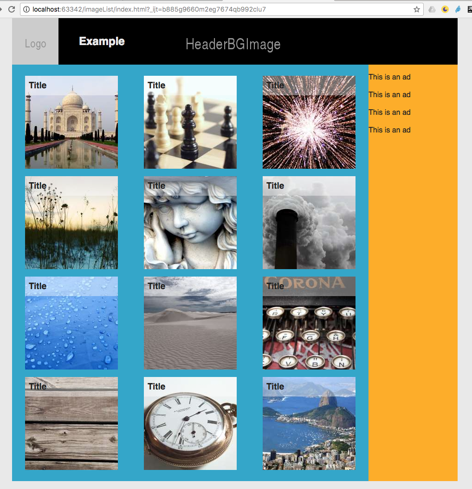

# CSS Exercise - Image List

1. Clone this repo to a folder of your choise `git clone https://github.com/ilkkamtk/imageList.git` or download as ZIP
2. Edit css/main.css
  * The thumbnails (li elements) should form a grid
  * The title of the image (h3 element) should be on top of the thumbnails
  * On desktop main and aside elements should be side by side
  
>Example layout:

  
  
  * Extra: On mobile main and aside elements should be one below the other
  
Some help:
  * http://www.w3schools.com/cssref/pr_list-style-type.asp
  * https://www.w3schools.com/css/css_positioning.asp
  * http://users.metropolia.fi/~ullamu/webdev/flexbox
  * https://css-tricks.com/snippets/css/a-guide-to-flexbox/
  * http://www.w3schools.com/css/css3_mediaqueries.asp
